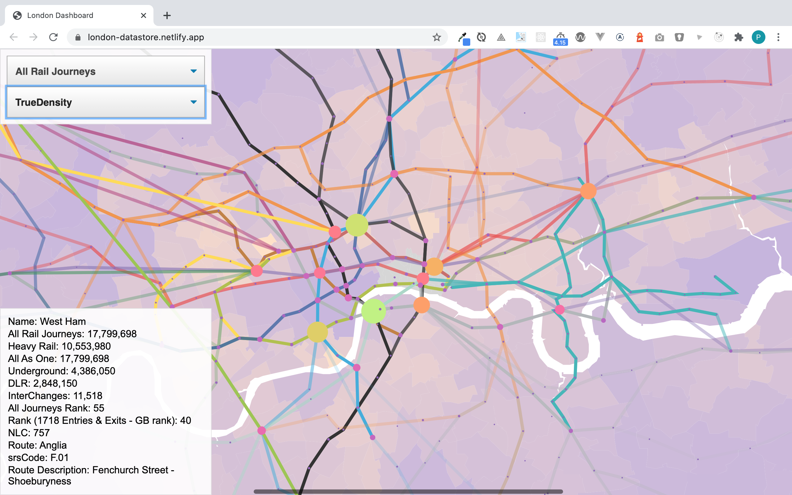

# London Datastore

Combining data on transport, jobs, space and populations to create a perspective on London as a city.

As a city London has been divided into 32 boroughs. Within these areas local governments are responsible for providing services, however not all boroughs are created equally.

[https://london-datastore.netlify.app/]

